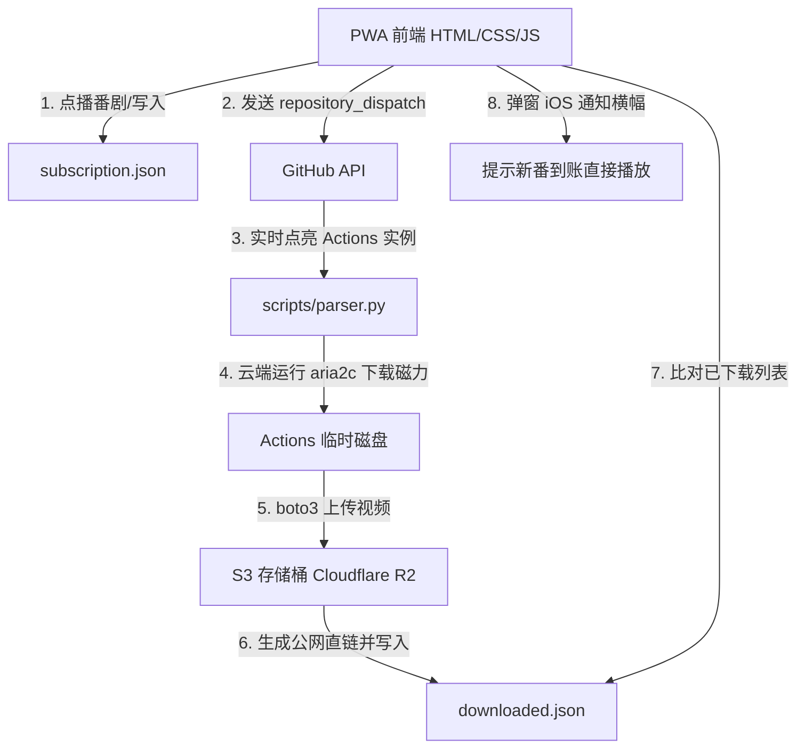

# 项目记忆与架构决策 (Project Memory)

## 📌 项目基本概况
* **项目名称**：纯云端番剧助手 PWA (基于 GitHub Pages + Actions + S3 免费托管)
* **核心理念**：本地零常驻进程、零运行设备、去网盘依赖。利用 GitHub Actions 现场运行 `aria2c` 进行种子极速下载，自动上传到免费 S3（如 Cloudflare R2），通过 PWA 网页播放器在线点播、接收新片到账通知。

---

## 🏗️ 架构设计与技术栈 (S3 点播版)

### 1. 前端 PWA Component
* **文件**：`index.html`、`style.css`、`app.js`、`manifest.json`
* **技术**：Vanilla HTML5/CSS3/JS，ArtPlayer.js 播放器，Hls.js 视频流解码库。
* **设计风格**：Apple Minimal 2026（顶部 iOS 横幅 Toast 通知、折叠卡片列表、全屏播放）。
* **通知机制**：每次刷新时对比最新 `downloaded.json` 直链与 LocalStorage 中的已阅记录，发现未读视频则拉起顶部 Toast 提示：“新片到账”，点击直接开播。

### 2. 云端 Actions Controller
* **文件**：`scripts/parser.py`、`.github/workflows/auto_bangumi.yml`
* **主要职责**：
  - 定时或通过 `repository_dispatch` 实时拉起。
  - 云端安装并配置 `aria2` 下发磁力链接下载。
  - 使用 `boto3` 将视频上传到指定 S3 桶（如 Cloudflare R2 / Backblaze B2），获取播放直链并回写更新 `downloaded.json`。
  - **7天过期清理**：每次运行自动扫描存储桶中已存在超过 7 天的文件并将其删除，将空间控制在 10GB 免费限额内。

---

## 🔑 S3 安全与凭证配置
* **安全底线**：**S3 密钥（ENDPOINT, ACCESS_KEY, SECRET_KEY）只存放在 GitHub Secrets 里，前端 PWA 绝对不可见，也无需配置**。PWA 前端只消费 Actions 回写并发布的公开视频直链，从而完美保护用户的云存储安全。
* **仓库状态**：**请务必使用 Private (私有仓库)** 托管代码，保护您的订阅配置与直链。

---

## ⚠️ 避坑记录与优化策略

### 1. 跨域与播放器兼容
* **问题**：视频直链格式通常有 MKV 和 MP4。Safari 对 MKV (H.265) 解码较弱。
* **解决**：ArtPlayer.js 中集成了基于 `hls.js` 的流解码。我们建议在点播时，如果字幕组发布了 MP4 1080p 格式，优先点播 MP4（网页兼容性最佳）。同时 Actions 在上传到 S3 时，会根据扩展名设置正确的 `Content-Type`（如 `video/mp4` 或者是 `video/x-matroska`），防止浏览器打开时被误识别为附件下载。

### 2. 任务防死锁
* **问题**：部分老旧种子可能会因为没有 Peer 节点导致 GitHub Actions 在下载时无限挂起直至超时。
* **解决**：在 Python 的 `aria2c` 命令中加入了 `--bt-stop-timeout=180` 参数。若下载任务在 3 分钟内没有获取到新数据，aria2 将会自动超时退出，防止 Actions 被死锁挂死。
