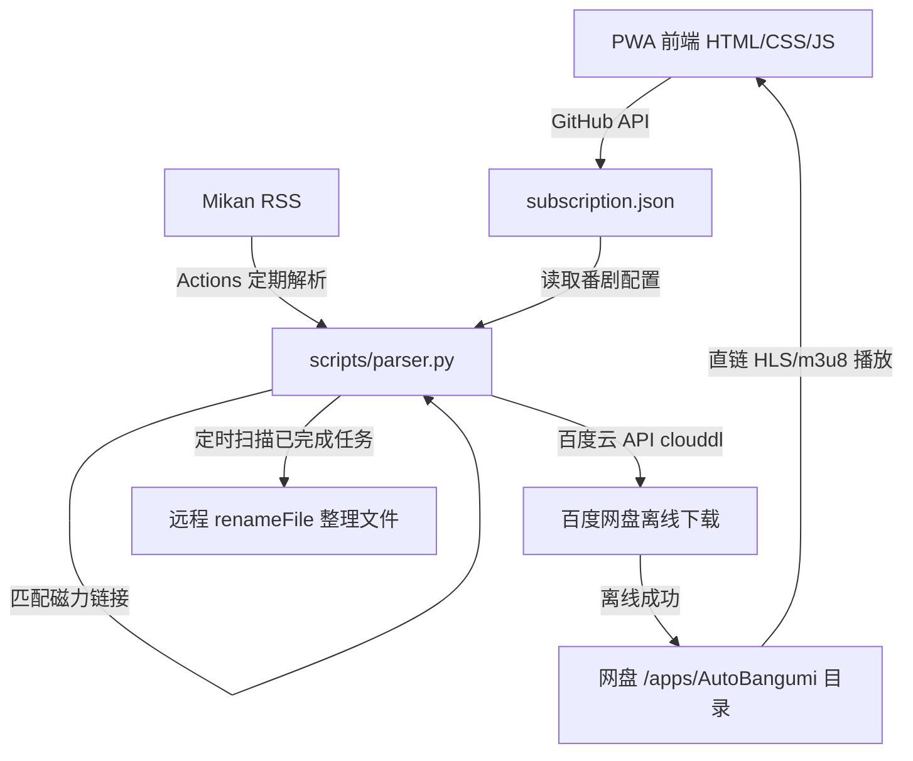

# 项目记忆与架构决策 (Project Memory)

## 📌 项目基本概况
* **项目名称**：纯云端番剧助手 PWA (基于 GitHub Pages + Actions + 百度云)
* **核心理念**：本地零常驻进程、零 Docker、零内网穿透。完全利用 GitHub Actions 在云端解析订阅，利用百度云离线下载并远程 API 整理，最终在 PWA 网页播放器中实现直链播放。

---

## 🏗️ 架构设计与技术栈

### 1. 前端 PWA Component
* **文件**：`index.html`、`style.css`、`app.js`、`manifest.json`
* **技术**：Vanilla HTML5/CSS3/JS，ArtPlayer.js 播放器，Hls.js 视频流解码库。
* **设计风格**：Apple Minimal 2026（毛玻璃卡片、自适应暗黑背景、无边界 Standalone 视口体验）。
* **百度云对接**：前端使用 `method=streaming` 接口获取网盘内视频文件的 HLS 流，直接在网页内渲染播放，免去本地搭建流媒体的门槛。

### 2. 云端 Actions Controller
* **文件**：`scripts/parser.py`、`.github/workflows/auto_bangumi.yml`
* **技术**：Python 3.10，`requests` 库，GitHub Actions 工作流。
* **主要职责**：定时拉取 Mikan RSS -> 标题结构化解析（SXXEXX）-> 下发百度云离线下载任务 -> 远程扫描百度云任务状态并进行文件名重命名整理 -> 回写更新 `downloaded.json` 与 `baidu_credentials.json` 并 commit 推送回仓库。

---

## 🔑 核心安全与凭证持久化设计
* 静态密钥（`BAIDU_CLIENT_ID` 和 `BAIDU_CLIENT_SECRET`）属于静态数据，安全存储在 **GitHub Repository Secrets** 中。
* 动态凭证（`refresh_token` 和 `access_token`）在每次 Actions 运行刷新后会实时改变。
* **免维护设计**：我们没有采用回写 GitHub Secrets（因为需要 Libsodium 加密且权限过重），而是将刷新后的最新 Token 保存在 **私有仓库的 `baidu_credentials.json` 文件** 中。Actions 每次运行结束时会自动将新 Token 执行 `git commit && git push` 回仓库，实现了 Token 的**永久自我刷新与免人工干预维护**。
* **安全底线**：**用户必须将 GitHub 仓库设置为 Private (私有仓库)**，防止凭证文件被公网公开。

---

## ⚠️ 踩坑记录与避坑指南

### 1. 百度网盘跨域 (CORS) 与直链限制
* **问题**：直接在前端使用百度网盘下载直链会遇到 403 跨域或严重的防盗链限速。
* **解决**：在网页端必须调用百度网盘的 `streaming` 视频转码流接口（返回 m3u8 地址），百度服务器会自动对视频进行云端切片转码，极速且支持跨域，利用 Hls.js 可以直接流畅播放。

### 2. 百度网盘 clouddl 任务数量限制
* **问题**：百度网盘对非会员有每日离线任务次数限制（通常是 5~10 次/天）。
* **解决**：我们的 `downloaded.json` 会永久记录已推送的磁力链接，防止 GitHub Actions 每小时重复向百度推送相同任务，有效保护了非会员额度不被浪费。

### 3. GitHub Actions 触发回写死循环
* **问题**：GitHub Actions 运行后向仓库提交修改，可能会无限触发 Actions 自身的 push 工作流导致死循环。
* **解决**：在 actions 的 commit message 中添加了 `[skip ci]` 前缀（如 `git commit -m "... [skip ci]"`），这样 GitHub Actions 在检测到该提交时会主动忽略，避免了死循环。
