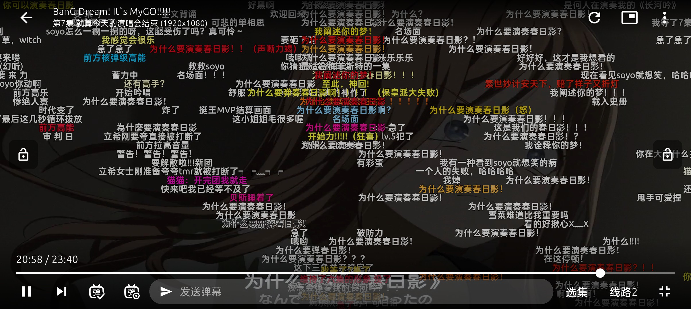
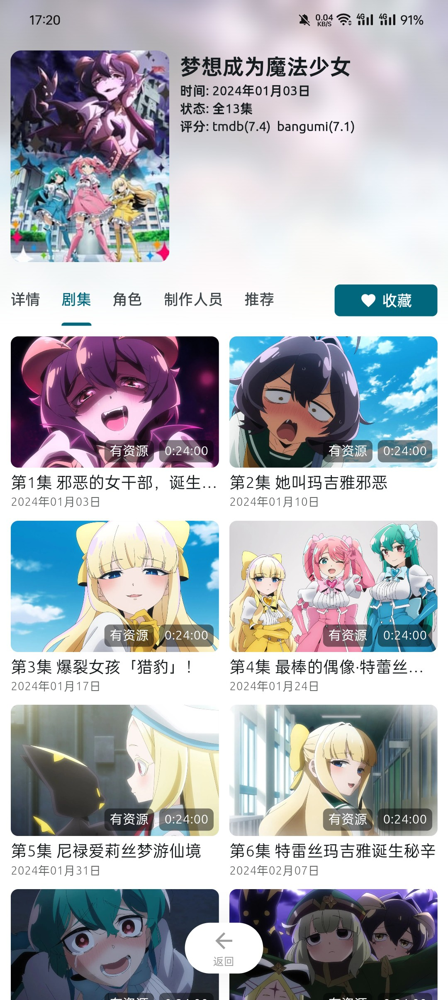
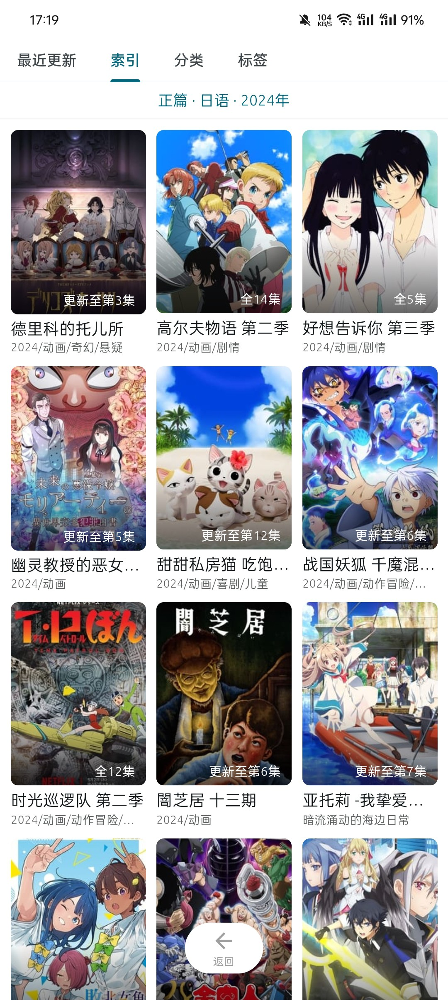

<h1 align="center">AniCh</h1>

一个支持超分辨率的在线动漫弹幕APP。多平台，多番剧源，多弹幕，高清无广告。追番看番必备软件。

## 下载

点击前往 [发布页](https://github.com/Sle2p/AniCh/releases/latest) 下载

## 预览
开发中。实际样式请以最新版本为准。

|  |  |
| ---- | ---- |

|  |  |
| ---- | ---- |

## 功能

- [x] 超分辨率
- [x] 番剧索引
- [x] 番剧搜索
- [x] 倍速播放
- [x] 观看记录
- [x] 追番管理
- [x] 番剧弹幕
- [x] 弹幕举报
- [x] 弹幕过滤
- [x] 分集评论
- [x] 离线缓存
- [ ] 番剧评分
- [ ] ...

## 说明

> [!IMPORTANT]
> 源码对应版本 [1.0.0](https://github.com/Sle2p/AniCh/releases/tag/1.0.0)
>
> 日期：2024-08-25

## 自建视频中转通道

如果你在公网 HTTPS 网页上播放“西瓜 VIP”或“非凡”等受拦截的线路，可以通过 Cloudflare 免费部署一个专属的 HTTP 网页代理，彻底解决安全拦截限制：

### ⏱️ 傻瓜级 1 分钟获取步骤

1. **登录 Cloudflare**：打开 [Cloudflare 控制台](https://dash.cloudflare.com/) 注册并登录你的账户（完全免费，无需绑定信用卡）。
2. **创建 Worker**：
   * 点击左侧菜单的 **`Workers & Pages` (Workers 和 Pages)**。
   * 点击 **`Create Application` (创建应用程序)** ➡️ 选择 **`Create Worker` (创建 Worker)**。
   * 输入你的 Worker 名字（例如 `my-proxy`），点击 **`Deploy` (部署)**。
3. **编辑代码并保存**：
   * 部署完成后，点击 **`Edit code` (快速编辑)** 进入代码编辑页。
   * 将里面的默认代码全部清空。
   * 复制并粘贴我们项目中的 [cf_worker_proxy.js](file:///Users/anranyunxiaomo/.gemini/antigravity/brain/189c8867-8d88-4026-8b4d-7bf1d49e969b/scratch/cf_worker_proxy.js) 代码进去（你也可以在项目 `.ai/` 或 `scratch/` 目录下找到它）。
   * 点击右上角的 **`Save and deploy` (保存并部署)**。
4. **填入网页使用**：
   * 部署成功后，你会得到一个专属的 HTTPS 代理链接，格式为：
     `https://你的Worker名字.你的用户名.workers.dev`
   * 回到你的追番网页，开启“免拦截中转”，在输入框中填入该链接，点击 **`应用并刷新`**。
   * 此时你就可以直接在 GitHub Pages 上免去一切 Mixed Content 拦截，顺畅看番了！